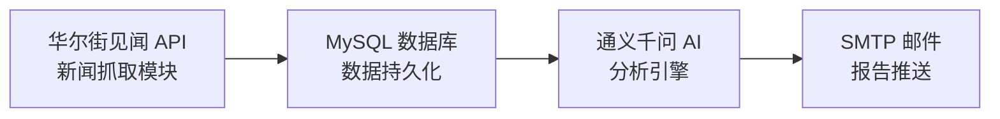

# NewsAnalysis - 华尔街见闻快讯分析

[](https://www.python.org/)
[](LICENSE)

一个自动化金融新闻分析系统，从**华尔街见闻**抓取实时快讯，利用**通义千问 AI**进行深度宏观分析，并通过邮件推送专业投资策略报告。

## 📋 目录

- [项目结构](#-项目结构)
- [功能特性](#-功能特性)
- [系统架构](#-系统架构)
- [工作流程](#工作流程)
- [快速开始](#-快速开始)
- [配置说明](#配置说明)
- [定时任务](#-定时任务)
- [注意事项](#-注意事项)
- [贡献](#-贡献)
- [联系方式](#-联系方式)
- [写在最后](#-写在最后)

## 📁 项目结构
```
NewsAnalysis/
├── main.py              # 程序入口，主流程控制
├── config.py            # 全局配置文件
├── wscn_fetcher.py      # 新闻抓取与数据库操作
├── summarize_news.py    # AI 总结与邮件发送
├── README.md            # 项目文档
└── requirements.txt     # Python 依赖列表（可选）
```

## ✨ 功能特性

- **实时新闻抓取**：从华尔街见闻 API 自动抓取最新全球金融市场快讯
- **智能去重存储**：基于 MySQL 的新闻持久化，支持自动去重和过期清理
- **AI 深度分析**：调用通义千问大模型，以华尔街资深分析师视角输出专业报告
- **多维度资产分析**：覆盖 A 股、美股、债券、汇率、黄金、原油六大资产类别
- **HTML 邮件推送**：支持 Markdown 转 HTML，美观的邮件格式，可配置开关
- **灵活参数配置**：时间窗口、保留天数、频道选择等均可自定义

## 🏗️ 系统架构



### 工作流程

1. **数据采集阶段**
   - 调用华尔街见闻 API 抓取指定频道的最新快讯
   - 清洗 HTML 标签，提取纯文本内容
   - 批量存入 MySQL 数据库（支持去重更新）
   - 可选清理过期新闻（防止数据库膨胀）

2. **分析推送阶段**
   - 从数据库提取指定时间窗口内的新闻
   - 构造专业 Prompt，调用通义千问 API 进行深度分析
   - 生成包含核心叙事、市场情绪、资产影响的分析报告
   - 将 Markdown 格式报告转为 HTML，通过 SMTP 发送邮件

## 🚀 快速开始

### 前置条件

- Python 3.8+
- MySQL 5.7+
- 阿里云 DashScope API Key（通义千问）
- QQ 邮箱或其他支持 SMTP 的邮箱账号

### 安装步骤

1. **克隆项目**
```bash
git clone git@github.com:PeterZhang3686/NewsAnalysis.git
cd NewsAnalysis
```

2. **安装依赖**
```bash
pip install -r requirements.txt
```

3. **创建数据库表**

```sql
CREATE TABLE IF NOT EXISTS `wscn_news_global` (
    `id` VARCHAR(64) NOT NULL COMMENT '新闻ID',
    `display_time` DATETIME NULL COMMENT '发布时间',
    `full_content` LONGTEXT NULL COMMENT '新闻正文',
    `created_at` TIMESTAMP DEFAULT CURRENT_TIMESTAMP COMMENT '插入本地数据库的时间',
    PRIMARY KEY (`id`)
) ENGINE=InnoDB DEFAULT CHARSET=utf8mb4 COLLATE=utf8mb4_unicode_ci;
```

4. **修改配置**

   编辑 `config.py` 文件，填入配置信息：

```python
# 数据库配置
DB_CONFIG = {
    'host': '127.0.0.1',
    'port': 3306,
    'user': 'your_db_user',
    'password': 'your_db_password',
    'database': 'your_db',
    'charset': 'utf8mb4'
}

# 通义千问 (DashScope) API 配置
QWEN_API_URL = "API URL"
QWEN_API_KEY = "API Key"
QWEN_MODEL = "Model Name"

# 邮件发送配置 (SMTP)
SMTP_HOST = "smtp.qq.com"               # SMTP 服务器，QQ 邮箱示例
SMTP_PORT = 465                         # SSL 端口
SMTP_USER = "Sender Email"              # 发件人邮箱
SMTP_PASSWORD = "SMTP Authorization Code" # SMTP 授权码
EMAIL_TO = "Recipient Email"            # 收件人邮箱
EMAIL_SUBJECT = "华尔街见闻快讯摘要"
```

5. **运行程序**

```bash
python main.py
```

### 核心参数 (`config.py`)
| 参数名 | 默认值 | 说明 | 所属模块 |
|--------|--------|------|----------|
| `SUMMARIZE_DAYS` | `7` | 总结最近多少天的新闻 | main.py |
| `FETCH_HOURS` | `24` | 抓取最近多少小时的快讯 | wscn_fetcher.py |
| `DEFAULT_CHANNEL` | `"global-channel"` | 抓取快讯的频道 | wscn_fetcher.py |
| `DEFAULT_LIMIT` | `50` | 单次请求的快讯条数上限 | wscn_fetcher.py |
| `SEND_EMAIL` | `True` | True = 总结完成后发送邮件；False = 仅在控制台打印，不发送邮件 | main.py |
| `SHOULD_CLEAN_OLD_NEWS` | `True` | True = 启动时清理过期旧新闻；False = 不清理 | 旧新闻清理配置 |
| `DEFAULT_RETENTION_DAYS` | `7` | 新闻保留天数，超过此天数的记录会被删除 | 旧新闻清理配置 |

## ⏰ 定时任务

### Linux (Cron)

每天上午 8 点执行分析：

```bash
# 编辑 crontab
crontab -e

# 添加任务（北京时间 UTC+8）
0 8 * * * /usr/bin/python3 /path/to/NewsAnalysis/main.py >> /var/log/news_analysis.log 2>&1
```

### Windows (Task Scheduler)

1. 打开「任务计划程序」
2. 创建基本任务 → 设置触发器（每天 8:00）
3. 操作：启动程序 → `python.exe` → 参数：`main.py`

### Docker（推荐生产环境）

```dockerfile
FROM python:3.11-slim

WORKDIR /app
COPY requirements.txt .
RUN pip install --no-cache-dir -r requirements.txt

COPY . .
CMD ["python", "main.py"]
```

配合 `docker-compose.yml` 和 cron 容器实现定时调度。

## ⚠️ 注意事项

### 安全警告

🔴 **切勿将 `config.py` 提交到 Git 仓库！**

将 `config.py` 加入 `.gitignore`：
```bash
echo "config.py" >> .gitignore
```

### API 限制

- **华尔街见闻**：建议设置合理请求间隔（已内置 0.5s 延迟）
- **通义千问**：注意 DashScope 的 QPS 限制和 Token 配额
- **SMTP 邮件**：QQ 邮箱有每日发送上限，避免频繁触发风控

### 数据合规

- 本工具仅供个人学习和研究使用
- 请勿将抓取的数据用于商业用途
- 遵守华尔街见闻网站的 `robots.txt` 协议和服务条款

### 故障排查

| 问题 | 可能原因 | 解决方案 |
|------|----------|----------|
| 数据库连接失败 | MySQL 未启动/密码错误 | 检查服务状态和 `DB_CONFIG` |
| API 返回 401 | API Key 无效 | 在阿里云控制台重新生成 |
| 邮件发送失败 | SMTP 授权码错误 | 在邮箱设置中重新获取授权码 |
| 无新闻数据 | 时间窗口内无数据 | 增大 `FETCH_HOURS` 或检查 API 响应 |


## 🤝 贡献

欢迎提交 Issue 和 Pull Request！

## 📬 联系方式

如有问题或建议，请通过 Issue 反馈。

## 💬 写在最后
最近对金融新闻分析产生了兴趣，便想着能否结合技术做一些探索与实践，于是有了这个项目的雏形。受限于个人水平，项目中难免存在不足与疏漏之处，还望各位不吝指正。
未来计划进一步拓展数据源，加入对财联社新闻的爬取支持，以丰富分析维度；同时也会逐步加大分析的时间跨度，尝试从更长周期中捕捉市场脉络，希望这个小工具能为同样关注金融市场的朋友提供一点参考。
